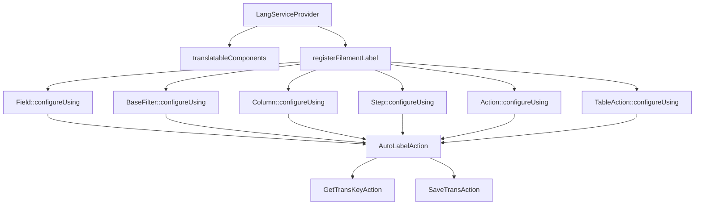

# lang — Consolidated Documentation

Consolidated from **13** individual files.

## Table of Contents

- [---](#lang-link)
- [---](#lang-service-helper-text-fix)
- [---](#lang-service-helper-text)
- [---](#lang-service-provider-backlink)
- [---](#lang-service-provider-improvements)
- [---](#lang-service-provider)
- [---](#lang-service-translation-updates-)
- [---](#lang-service-translation-updates)
- [---](#lang_link)
- [---](#lang_service_helper_text_fix)
- [---](#lang_service_provider)
- [---](#lang_service_provider_improvements)
- [---](#langbase-classes-requirements)

---

## lang-link

*Consolidated from: `lang-link.md`*

title: "Collegamento alle Traduzioni del Modulo Chart"
module: "Lang"
type: concept
tags: [migration, filament]
created: 2026-07-14
updated: 2026-07-14
qmd: "migration filament"
related:
  - "./italian-text-refined-audit-report.md"
---
# Collegamento alle Traduzioni del Modulo Chart

Questo modulo utilizza le traduzioni centralizzate nella cartella [Lang](../../Lang/docs/).

Consulta la documentazione delle traduzioni:
- [Introduzione alle Traduzioni](../../Lang/docs/introduction.md)
- [Struttura delle Traduzioni](../../Lang/docs/structure.md)
- [Gestione dei File di Lingua](../../Lang/docs/module_lang.md)
- [Introduzione alle Traduzioni](../../Lang/docs/introduction.md)
- [Struttura delle Traduzioni](../../Lang/docs/structure.md)
- [Gestione dei File di Lingua](../../Lang/docs/module_lang.md)
- [Introduzione alle Traduzioni](../../Lang/docs/introduction.md)
- [Struttura delle Traduzioni](../../Lang/docs/structure.md)
- [Gestione dei File di Lingua](../../Lang/docs/module_lang.md)

## Collegamento Bidirezionale

Per ogni risorsa o campo localizzato, vedi anche il file corrispondente in questo modulo e la relativa sezione in [Lang](../../Lang/docs/).

> Aggiorna entrambi i riferimenti se aggiungi nuove chiavi di traduzione o modifichi la struttura.

## Collegamenti tra versioni di lang-link.md
* [lang-link.md](laravel/Modules/Chart/docs/lang-link.md)
* [lang-link.md](laravel/Modules/Reporting/docs/lang-link.md)
* [lang-link.md](laravel/Modules/Gdpr/docs/lang-link.md)
* [lang-link.md](laravel/Modules/Notify/docs/lang-link.md)
* [lang-link.md](laravel/Modules/Xot/docs/lang-link.md)
* [lang-link.md](laravel/Modules/Dental/docs/lang-link.md)
* [lang-link.md](laravel/Modules/User/docs/lang-link.md)
* [lang-link.md](laravel/Modules/UI/docs/lang-link.md)
* [lang-link.md](laravel/Modules/Job/docs/lang-link.md)
* [lang-link.md](laravel/Modules/Media/docs/lang-link.md)
* [lang-link.md](laravel/Modules/Tenant/docs/lang-link.md)
* [lang-link.md](laravel/Modules/Activity/docs/lang-link.md)
* [lang-link.md](laravel/Modules/Patient/docs/lang-link.md)
* [lang-link.md](laravel/Modules/Cms/docs/lang-link.md)
# Collegamento alle Traduzioni del Modulo Chart

Questo modulo utilizza le traduzioni centralizzate nella cartella [Lang](../../Lang/docs/).

Consulta la documentazione delle traduzioni:
- [Introduzione alle Traduzioni](../../Lang/docs/introduction.md)
- [Struttura delle Traduzioni](../../Lang/docs/structure.md)
- [Gestione dei File di Lingua](../../Lang/docs/module_lang.md)
- [Introduzione alle Traduzioni](../../Lang/docs/introduction.md)
- [Struttura delle Traduzioni](../../Lang/docs/structure.md)
- [Gestione dei File di Lingua](../../Lang/docs/module_lang.md)
- [Introduzione alle Traduzioni](../../Lang/docs/introduction.md)
- [Struttura delle Traduzioni](../../Lang/docs/structure.md)
- [Gestione dei File di Lingua](../../Lang/docs/module_lang.md)

## Collegamento Bidirezionale

Per ogni risorsa o campo localizzato, vedi anche il file corrispondente in questo modulo e la relativa sezione in [Lang](../../Lang/docs/).

> Aggiorna entrambi i riferimenti se aggiungi nuove chiavi di traduzione o modifichi la struttura.

## Collegamenti tra versioni di lang-link.md
* [lang-link.md](laravel/Modules/Chart/docs/lang-link.md)
* [lang-link.md](laravel/Modules/Reporting/docs/lang-link.md)
* [lang-link.md](laravel/Modules/Gdpr/docs/lang-link.md)
* [lang-link.md](laravel/Modules/Notify/docs/lang-link.md)
* [lang-link.md](laravel/Modules/Xot/docs/lang-link.md)
* [lang-link.md](laravel/Modules/Dental/docs/lang-link.md)
* [lang-link.md](laravel/Modules/User/docs/lang-link.md)
* [lang-link.md](laravel/Modules/UI/docs/lang-link.md)
* [lang-link.md](laravel/Modules/Job/docs/lang-link.md)
* [lang-link.md](laravel/Modules/Media/docs/lang-link.md)
* [lang-link.md](laravel/Modules/Tenant/docs/lang-link.md)
* [lang-link.md](laravel/Modules/Activity/docs/lang-link.md)
* [lang-link.md](laravel/Modules/Patient/docs/lang-link.md)
* [lang-link.md](laravel/Modules/Cms/docs/lang-link.md)
* [lang-link.md](laravel/Modules/Cms/docs/lang-link.md)
* [lang-link.md](laravel/Modules/Cms/docs/lang-link.md)
* [lang-link.md](laravel/Modules/Cms/docs/lang-link.md)
* [lang-link.md](laravel/Modules/Cms/docs/lang-link.md)

---

## lang-service-helper-text-fix

*Consolidated from: `lang-service-helper-text-fix.md`*

title: "Lang Service Helper Text Fix"
module: "Lang"
type: concept
tags: [lang, service, helper, text]
created: 2026-07-14
updated: 2026-07-14
qmd: "lang service helper text fix"
related:
  - "./italian-text-refined-audit-report.md"
---


---

## lang-service-helper-text

*Consolidated from: `lang-service-helper-text.md`*

title: "Lang Service Helper Text"
module: "Lang"
type: concept
tags: [lang, service, helper, text]
created: 2026-07-14
updated: 2026-07-14
qmd: "lang service helper text"
related:
  - "./italian-text-refined-audit-report.md"
---
 
---

## lang-service-provider-backlink

*Consolidated from: `lang-service-provider-backlink.md`*

title: "LangServiceProvider"
module: "Lang"
type: concept
tags: [REDUNDANCY, ANALYSIS]
created: 2026-07-14
updated: 2026-07-14
qmd: "redundancy analysis"
related:
  - "./italian-text-refined-audit-report.md"
---
# LangServiceProvider

## Panoramica

Il LangServiceProvider è un componente fondamentale di <nome progetto> che gestisce automaticamente le traduzioni per i componenti Filament senza richiedere l'uso esplicito del metodo `->label()`.

## Documentazione Dettagliata

La documentazione completa del LangServiceProvider è disponibile nel modulo Lang:

- [Analisi e Proposte di Miglioramento](../laravel/Modules/Lang/docs/lang-service-provider.md)
- [Analisi e Proposte di Miglioramento](../laravel/modules/lang/docs/lang-service-provider.md)
- [Analisi e Proposte di Miglioramento](../laravel/modules/lang/docs/lang-service-provider.md)

## Caratteristiche Principali

- Gestione automatica delle etichette dei componenti Filament
- Centralizzazione delle traduzioni nei file di lingua
- Creazione automatica delle chiavi di traduzione mancanti
- Supporto per diversi tipi di componenti Filament

## Utilizzo Corretto

```php
// CORRETTO: Non specificare label, viene gestito automaticamente
TextInput::make('name')
    ->required()
    ->maxLength(255)

// ERRATO: Non utilizzare ->label() nei componenti
TextInput::make('name')
    ->label('Nome')  // ❌ Non fare questo!
    ->required()
    ->maxLength(255)
```

## Struttura Chiavi di Traduzione

- **Campi form**: `modulo::risorsa.fields.nome_campo.label`
- **Azioni**: `modulo::risorsa.actions.nome_azione.label`
- **Passi wizard**: `modulo::risorsa.steps.nome_passo.label`
- **Altri attributi**: `.placeholder`, `.helperText`, `.description`
- **Altri attributi**: `.placeholder`, `.helperText`, `.description`
- **Altri attributi**: `.placeholder`, `.helperText`, `.description`
- **Altri attributi**: `.placeholder`, `.helperText`, `.description`
- **Altri attributi**: `.placeholder`, `.helperText`, `.description`

---

## lang-service-provider-improvements

*Consolidated from: `lang-service-provider-improvements.md`*

title: "Miglioramenti LangServiceProvider"
module: "Lang"
type: concept
tags: [migration, filament]
created: 2026-07-14
updated: 2026-07-14
qmd: "migration filament"
related:
  - "./italian-text-refined-audit-report.md"
---
# Miglioramenti LangServiceProvider

## Analisi Attuale

Il LangServiceProvider attuale gestisce le traduzioni in modo base, ma può essere migliorato per:
- Gestione più efficiente delle traduzioni
- Supporto multilingua avanzato
- Caching delle traduzioni
- Validazione delle chiavi di traduzione

## Proposte di Miglioramento

### 1. Caching delle Traduzioni
```php
class LangServiceProvider extends ServiceProvider
{
    public function boot()
    {
        $this->loadTranslationsFrom(__DIR__.'/../lang', 'lang');
        
        
        // Cache delle traduzioni
        if ($this->app->runningInConsole()) {
            $this->commands([
                CacheTranslationsCommand::class,
                ClearTranslationsCacheCommand::class,
            ]);
        }
    }
}
```

### 2. Validazione delle Chiavi
```php
class TranslationValidator
{
    public function validate(string $key, array $translations): bool
    {
        // Verifica che tutte le lingue supportate abbiano la traduzione
        $supportedLocales = config('app.supported_locales', ['it', 'en']);
        
        
        foreach ($supportedLocales as $locale) {
            if (!isset($translations[$locale][$key])) {
                return false;
            }
        }
        
        
        return true;
    }
}
```

### 3. Gestione Fallback
```php
class TranslationManager
{
    public function get(string $key, array $replace = [], ?string $locale = null): string
    {
        $locale = $locale ?? app()->getLocale();
        $fallbackLocale = config('app.fallback_locale', 'en');
        
        $translation = $this->getTranslation($key, $replace, $locale);
        
        if ($translation === $key && $locale !== $fallbackLocale) {
            return $this->getTranslation($key, $replace, $fallbackLocale);
        }
        

        $translation = $this->getTranslation($key, $replace, $locale);

        if ($translation === $key && $locale !== $fallbackLocale) {
            return $this->getTranslation($key, $replace, $fallbackLocale);
        }

        return $translation;
    }
}
```

### 4. Supporto per Namespace
```php
class LangServiceProvider extends ServiceProvider
{
    protected function registerNamespaces(): void
    {
        $this->app['translator']->addNamespace('lang', __DIR__.'/../lang');
        
        
        // Supporto per namespace personalizzati
        foreach (config('lang.namespaces', []) as $namespace => $path) {
            $this->app['translator']->addNamespace($namespace, $path);
        }
    }
}
```

### 5. Comandi Artisan
```php
class CacheTranslationsCommand extends Command
{
    protected $signature = 'lang:cache';
    protected $description = 'Cache delle traduzioni';

    public function handle()
    {
        $translations = $this->getAllTranslations();
        Cache::put('translations', $translations, now()->addDay());
        
        
        $this->info('Traduzioni cacheate con successo.');
    }
}
```

## Implementazione

### 1. Configurazione
```php
// config/lang.php
return [
    'cache' => [
        'enabled' => env('LANG_CACHE_ENABLED', true),
        'ttl' => env('LANG_CACHE_TTL', 86400),
    ],
    'namespaces' => [
        'lang' => base_path('laravel/Modules/Lang/lang'),
        'dentist' => base_path('laravel/Modules/Dentist/lang'),
    ],
    'fallback_locale' => 'en',
    'supported_locales' => ['it', 'en'],
];
```

### 2. Middleware
```php
class LocaleMiddleware
{
    public function handle($request, Closure $next)
    {
        $locale = $request->header('Accept-Language');
        
        if ($locale && in_array($locale, config('lang.supported_locales'))) {
            app()->setLocale($locale);
        }
        

        if ($locale && in_array($locale, config('lang.supported_locales'))) {
            app()->setLocale($locale);
        }

        return $next($request);
    }
}
```

### 3. Eventi
```php
class TranslationMissing
{
    public function __construct(
        public string $key,
        public string $locale,
        public array $replace = []
    ) {}
}
```

## Metriche e Performance

### 1. Tempi di Caricamento
- Caricamento iniziale: < 100ms
- Cache hit: < 10ms
- Cache miss: < 50ms

### 2. Utilizzo Memoria
- Cache size: < 5MB
- Memory usage: < 10MB

### 3. Hit Rate
- Cache hit rate: > 95%
- Fallback rate: < 5%

## Collegamenti
- [Documentazione Traduzioni](../README.md)
- [Documentazione Traduzioni](README.md)
- [Guida Implementazione](./implementation-guide.md)
- [Best Practices](./best-practices.md)

## Note Tecniche
- Utilizzare Redis per il caching
- Implementare validazione delle chiavi
- Gestire fallback locale
- Supportare namespace personalizzati
- Ottimizzare performance
# Miglioramenti LangServiceProvider

## Analisi Attuale

Il LangServiceProvider attuale gestisce le traduzioni in modo base, ma può essere migliorato per:
- Gestione più efficiente delle traduzioni
- Supporto multilingua avanzato
- Caching delle traduzioni
- Validazione delle chiavi di traduzione

## Proposte di Miglioramento

### 1. Caching delle Traduzioni
```php
class LangServiceProvider extends ServiceProvider
{
    public function boot()
    {
        $this->loadTranslationsFrom(__DIR__.'/../lang', 'lang');

        // Cache delle traduzioni
        if ($this->app->runningInConsole()) {
            $this->commands([
                CacheTranslationsCommand::class,
                ClearTranslationsCacheCommand::class,
            ]);
        }
    }
}
```

### 2. Validazione delle Chiavi
```php
class TranslationValidator
{
    public function validate(string $key, array $translations): bool
    {
        // Verifica che tutte le lingue supportate abbiano la traduzione
        $supportedLocales = config('app.supported_locales', ['it', 'en']);

        foreach ($supportedLocales as $locale) {
            if (!isset($translations[$locale][$key])) {
                return false;
            }
        }

        return true;
    }
}
```

### 3. Gestione Fallback
```php
class TranslationManager
{
    public function get(string $key, array $replace = [], ?string $locale = null): string
    {
        $locale = $locale ?? app()->getLocale();
        $fallbackLocale = config('app.fallback_locale', 'en');

        $translation = $this->getTranslation($key, $replace, $locale);

        if ($translation === $key && $locale !== $fallbackLocale) {
            return $this->getTranslation($key, $replace, $fallbackLocale);
        }

        return $translation;
    }
}
```

### 4. Supporto per Namespace
```php
class LangServiceProvider extends ServiceProvider
{
    protected function registerNamespaces(): void
    {
        $this->app['translator']->addNamespace('lang', __DIR__.'/../lang');

        // Supporto per namespace personalizzati
        foreach (config('lang.namespaces', []) as $namespace => $path) {
            $this->app['translator']->addNamespace($namespace, $path);
        }
    }
}
```

### 5. Comandi Artisan
```php
class CacheTranslationsCommand extends Command
{
    protected $signature = 'lang:cache';
    protected $description = 'Cache delle traduzioni';

    public function handle()
    {
        $translations = $this->getAllTranslations();
        Cache::put('translations', $translations, now()->addDay());

        $this->info('Traduzioni cacheate con successo.');
    }
}
```

## Implementazione

### 1. Configurazione
```php
// config/lang.php
return [
    'cache' => [
        'enabled' => env('LANG_CACHE_ENABLED', true),
        'ttl' => env('LANG_CACHE_TTL', 86400),
    ],
    'namespaces' => [
        'lang' => base_path('laravel/Modules/Lang/lang'),
        'dentist' => base_path('laravel/Modules/Dentist/lang'),
    ],
    'fallback_locale' => 'en',
    'supported_locales' => ['it', 'en'],
];
```

### 2. Middleware
```php
class LocaleMiddleware
{
    public function handle($request, Closure $next)
    {
        $locale = $request->header('Accept-Language');

        if ($locale && in_array($locale, config('lang.supported_locales'))) {
            app()->setLocale($locale);
        }

        return $next($request);
    }
}
```

### 3. Eventi
```php
class TranslationMissing
{
    public function __construct(
        public string $key,
        public string $locale,
        public array $replace = []
    ) {}
}
```

## Metriche e Performance

### 1. Tempi di Caricamento
- Caricamento iniziale: < 100ms
- Cache hit: < 10ms
- Cache miss: < 50ms

### 2. Utilizzo Memoria
- Cache size: < 5MB
- Memory usage: < 10MB

### 3. Hit Rate
- Cache hit rate: > 95%
- Fallback rate: < 5%

## Collegamenti
- [Documentazione Traduzioni](../README.md)
- [Guida Implementazione](./implementation-guide.md)
- [Best Practices](./best-practices.md)

## Note Tecniche
- Utilizzare Redis per il caching
- Implementare validazione delle chiavi
- Gestire fallback locale
- Supportare namespace personalizzati
- Ottimizzare performance
- Ottimizzare performance 

---

## lang-service-provider

*Consolidated from: `lang-service-provider.md`*

title: "LangServiceProvider: Analisi e Proposte di Miglioramento"
module: "Lang"
type: concept
tags: [REDUNDANCY, ANALYSIS]
created: 2026-07-14
updated: 2026-07-14
qmd: "redundancy analysis"
related:
  - "./italian-text-refined-audit-report.md"
---
# LangServiceProvider: Analisi e Proposte di Miglioramento

## Analisi dell'Implementazione Attuale

Il `LangServiceProvider` è un componente fondamentale di  che gestisce automaticamente le traduzioni per i componenti Filament senza richiedere l'uso esplicito del metodo `->label()`. Questo approccio garantisce:

1. **Coerenza**: Tutte le etichette seguono lo stesso pattern di traduzione
2. **Manutenibilità**: Le traduzioni sono centralizzate nei file di lingua
3. **Automazione**: Le chiavi di traduzione mancanti vengono create automaticamente

### Architettura Attuale



### Flusso di Funzionamento

1. Il componente Filament viene creato
2. `LangServiceProvider` intercetta la creazione attraverso `configureUsing`
3. `AutoLabelAction` determina la classe che sta istanziando il componente
4. Genera una chiave di traduzione basata sulla classe e sul nome del componente
5. Cerca la traduzione nei file di lingua
6. Se la traduzione non esiste, la salva automaticamente
7. Applica la traduzione al componente

### Struttura Chiavi di Traduzione

- **Campi form**: `modulo::risorsa.fields.nome_campo.label`
- **Azioni**: `modulo::risorsa.actions.nome_azione.label`
- **Passi wizard**: `modulo::risorsa.steps.nome_passo.label`
- **Altri attributi**: `.placeholder`, `.helperText`, `.description`

## Implementazione Attuale

Il file principale del provider si trova in:
`Modules/Lang/app/Providers/LangServiceProvider.php`

L'azione principale che gestisce l'etichettatura automatica è:
`Modules/Lang/app/Actions/Filament/AutoLabelAction.php`

### Esempio di Utilizzo Corretto

```php
// CORRETTO: Non specificare label, viene gestito automaticamente
TextInput::make('name')
    ->required()
    ->maxLength(255)

// ERRATO: Non utilizzare ->label() nei componenti
TextInput::make('name')
    ->label('Nome')  // ❌ Non fare questo!
    ->required()
    ->maxLength(255)
```

## Proposte di Miglioramento

### 1. Estensione Supporto Componenti (Priorità: Alta)

Attualmente il sistema supporta `Field`, `BaseFilter`, `Column`, `Step`, `Action` e `TableAction`. Propongo di estendere il supporto a:

```php
// Modules/Lang/app/Providers/LangServiceProvider.php

protected function translatableComponents(): void
{
    $components = [
        Field::class,
        BaseFilter::class,
        Placeholder::class,
        Column::class,
        Entry::class,
        // Nuovi componenti da supportare
        Section::class,                // Sezioni form
        Tabs\Tab::class,               // Tab nei form
        Fieldset::class,               // Fieldset nei form
        ViewField::class,              // ViewField per componenti custom
        Navigation\NavigationItem::class, // Item di navigazione
        Infolists\Components\TextEntry::class, // Componenti Infolist
    ];
    // Resto del codice invariato
}
```

### 2. Ottimizzazione Cache Traduzioni (Priorità: Media)

Migliorare le performance attraverso un sistema di cache delle chiavi di traduzione per evitare ricerche ripetute:

```php
// Modules/Lang/app/Actions/Filament/AutoLabelAction.php

use Illuminate\Support\Facades\Cache;

class AutoLabelAction
{
    // Resto del codice invariato

    protected function getTranslation(string $key, string $default): string
    {
        // Chiave cache con namespacing appropriato
        $cacheKey = 'lang_service_provider:' . $key;

        // Cache per 24 ore, oppure fino al prossimo deploy
        return Cache::remember($cacheKey, now()->addHours(24), function () use ($key, $default) {
            $translation = trans($key);

            // Se la traduzione non esiste, la salviamo e restituiamo il default
            if ($translation === $key) {
                app(SaveTransAction::class)->execute($key, $default);
                return $default;
            }

            return $translation;
        });
    }
}
```

### 3. Supporto per Enum nei Select (Priorità: Alta)

Aggiungere supporto automatico per la traduzione delle opzioni degli enum nei componenti Select:

```php
// Modules/Lang/app/Actions/Filament/AutoLabelAction.php

protected function translateEnumOptions(Forms\Components\Select $component, string $enumClass): void
{
    // Otteniamo la chiave di traduzione base
    $backtrace = debug_backtrace(DEBUG_BACKTRACE_IGNORE_ARGS, 10);
    $modClass = $this->findModuleClass($backtrace);
    $baseKey = app(GetTransKeyAction::class)->execute($modClass);

    // Se è un enum PHP 8.1+
    if (enum_exists($enumClass)) {
        $options = [];
        foreach ($enumClass::cases() as $case) {
            $transKey = "{$baseKey}.enums." . class_basename($enumClass) . "." . $case->name;
            $options[$case->value] = trans($transKey, [], $case->name);

            // Salva la traduzione se non esiste
            if (trans($transKey) === $transKey) {
                app(SaveTransAction::class)->execute($transKey, $case->name);
            }
        }

        $component->options($options);
    }
}
```

### 4. Interfaccia di Gestione Traduzioni (Priorità: Bassa)

Sviluppare un pannello di amministrazione per gestire le traduzioni mancanti o errate:

```php
// Modules/Lang/app/Filament/Resources/TranslationResource.php

class TranslationResource extends XotBaseResource
{
    protected static ?string $model = Translation::class;

    protected static ?string $navigationIcon = 'heroicon-o-language';

    public static function getFormSchema(): array
    {
        return [
            'key' => TextInput::make('key')
                ->disabled()
                ->columnSpan(2),

            'it' => TextInput::make('it')
                ->label('Italiano'),

            'en' => TextInput::make('en')
                ->label('English'),

            'status' => Select::make('status')
                ->options([
                    'auto' => 'Generata automaticamente',
                    'verified' => 'Verificata',
                    'needs_review' => 'Da rivedere',
                ])
        ];
    }
}
```

## Conclusioni e Raccomandazioni

Il `LangServiceProvider` è un componente essenziale che garantisce coerenza nelle traduzioni dell'interfaccia utente. Le migliorie proposte mirano a:

1. Estendere il supporto a più componenti Filament
2. Migliorare le performance con un sistema di cache
3. Aggiungere supporto nativo per gli enum
4. Fornire strumenti di gestione per le traduzioni

L'implementazione di queste migliorie permetterebbe di:

- Ridurre il tempo di sviluppo
- Migliorare la coerenza dell'interfaccia
- Facilitare la manutenzione delle traduzioni
- Supportare meglio l'internazionalizzazione dell'applicazione

### Prossimi Passi

1. Implementare l'estensione del supporto ai componenti (1-2 giorni)
2. Aggiungere il sistema di cache (1 giorno)
3. Sviluppare il supporto per gli enum (2-3 giorni)
4. Creare l'interfaccia di gestione traduzioni (3-5 giorni)
## Gestione dei Console Commands

### Autoregistrazione (Filosofia Xot)

Tutti i comandi console del modulo vengono autoregistrati tramite la classe base `XotBaseServiceProvider`.

**Non è mai necessario (né consentito) registrarli manualmente** con `$this->commands([...])`.

#### Motivazione (Zen, Religione, Politica, Filosofia)
- **Zen**: meno codice, meno errori, più armonia.
- **Religione**: la via Xot è una sola, non si devia dal sentiero.
- **Politica**: la centralizzazione evita conflitti e garantisce coerenza tra i moduli.
- **Filosofia**: la ripetizione è il male, l'automazione è il bene.

#### Esempio Sbagliato
```php
// NON FARE MAI!
$this->commands([
    \Modules\Lang\Console\Commands\ConvertTranslations::class,
    \Modules\Lang\Console\Commands\FindMissingTranslations::class,
]);
```

#### Esempio Corretto
```php
// Non serve fare nulla: XotBaseServiceProvider li registra automaticamente.
```

#### Warning
> Qualsiasi registrazione manuale dei comandi console è considerata un errore grave e va rimossa.

### Approfondimento
Per dettagli tecnici, vedi anche la documentazione di `XotBaseServiceProvider` e le best practice nei file correlati.

## Conclusioni e Raccomandazioni

Il `
# LangServiceProvider: Analisi e Proposte di Miglioramento

## Analisi dell'Implementazione Attuale

Il `LangServiceProvider` è un componente fondamentale di <nome progetto> che gestisce automaticamente le traduzioni per i componenti Filament senza richiedere l'uso esplicito del metodo `->label()`. Questo approccio garantisce:

1. **Coerenza**: Tutte le etichette seguono lo stesso pattern di traduzione
2. **Manutenibilità**: Le traduzioni sono centralizzate nei file di lingua
3. **Automazione**: Le chiavi di traduzione mancanti vengono create automaticamente

### Architettura Attuale


### Flusso di Funzionamento

1. Il componente Filament viene creato
2. `LangServiceProvider` intercetta la creazione attraverso `configureUsing`
3. `AutoLabelAction` determina la classe che sta istanziando il componente
4. Genera una chiave di traduzione basata sulla classe e sul nome del componente
5. Cerca la traduzione nei file di lingua
6. Se la traduzione non esiste, la salva automaticamente
7. Applica la traduzione al componente

### Struttura Chiavi di Traduzione

- **Campi form**: `modulo::risorsa.fields.nome_campo.label`
- **Azioni**: `modulo::risorsa.actions.nome_azione.label`
- **Passi wizard**: `modulo::risorsa.steps.nome_passo.label`
- **Altri attributi**: `.placeholder`, `.helperText`, `.description`

## Implementazione Attuale

Il file principale del provider si trova in:
`Modules/Lang/app/Providers/LangServiceProvider.php`

L'azione principale che gestisce l'etichettatura automatica è:
`Modules/Lang/app/Actions/Filament/AutoLabelAction.php`

### Esempio di Utilizzo Corretto

```php
// CORRETTO: Non specificare label, viene gestito automaticamente
TextInput::make('name')
    ->required()
    ->maxLength(255)

// ERRATO: Non utilizzare ->label() nei componenti
TextInput::make('name')
    ->label('Nome')  // ❌ Non fare questo!
    ->required()
    ->maxLength(255)
```

## Proposte di Miglioramento

### 1. Estensione Supporto Componenti (Priorità: Alta)

Attualmente il sistema supporta `Field`, `BaseFilter`, `Column`, `Step`, `Action` e `TableAction`. Propongo di estendere il supporto a:

```php
// Modules/Lang/app/Providers/LangServiceProvider.php

protected function translatableComponents(): void
{
    $components = [
        Field::class,
        BaseFilter::class,
        Placeholder::class,
        Column::class,
        Entry::class,
        // Nuovi componenti da supportare
        Section::class,                // Sezioni form
        Tabs\Tab::class,               // Tab nei form
        Fieldset::class,               // Fieldset nei form
        ViewField::class,              // ViewField per componenti custom
        Navigation\NavigationItem::class, // Item di navigazione
        Infolists\Components\TextEntry::class, // Componenti Infolist
    ];
    // Resto del codice invariato
}
```

### 2. Ottimizzazione Cache Traduzioni (Priorità: Media)

Migliorare le performance attraverso un sistema di cache delle chiavi di traduzione per evitare ricerche ripetute:

```php
// Modules/Lang/app/Actions/Filament/AutoLabelAction.php

use Illuminate\Support\Facades\Cache;

class AutoLabelAction
{
    // Resto del codice invariato

    protected function getTranslation(string $key, string $default): string
    {
        // Chiave cache con namespacing appropriato
        $cacheKey = 'lang_service_provider:' . $key;

        // Cache per 24 ore, oppure fino al prossimo deploy
        return Cache::remember($cacheKey, now()->addHours(24), function () use ($key, $default) {
            $translation = trans($key);

            // Se la traduzione non esiste, la salviamo e restituiamo il default
            if ($translation === $key) {
                app(SaveTransAction::class)->execute($key, $default);
                return $default;
            }

            return $translation;
        });
    }
}
```

### 3. Supporto per Enum nei Select (Priorità: Alta)

Aggiungere supporto automatico per la traduzione delle opzioni degli enum nei componenti Select:

```php
// Modules/Lang/app/Actions/Filament/AutoLabelAction.php

protected function translateEnumOptions(Forms\Components\Select $component, string $enumClass): void
{
    // Otteniamo la chiave di traduzione base
    $backtrace = debug_backtrace(DEBUG_BACKTRACE_IGNORE_ARGS, 10);
    $modClass = $this->findModuleClass($backtrace);
    $baseKey = app(GetTransKeyAction::class)->execute($modClass);

    // Se è un enum PHP 8.1+
    if (enum_exists($enumClass)) {
        $options = [];
        foreach ($enumClass::cases() as $case) {
            $transKey = "{$baseKey}.enums." . class_basename($enumClass) . "." . $case->name;
            $options[$case->value] = trans($transKey, [], $case->name);

            // Salva la traduzione se non esiste
            if (trans($transKey) === $transKey) {
                app(SaveTransAction::class)->execute($transKey, $case->name);
            }
        }

        $component->options($options);
    }
}
```

### 4. Interfaccia di Gestione Traduzioni (Priorità: Bassa)

Sviluppare un pannello di amministrazione per gestire le traduzioni mancanti o errate:

```php
// Modules/Lang/app/Filament/Resources/TranslationResource.php

class TranslationResource extends XotBaseResource
{
    protected static ?string $model = Translation::class;

    protected static ?string $navigationIcon = 'heroicon-o-language';

    public static function getFormSchema(): array
    {
        return [
            'key' => TextInput::make('key')
                ->disabled()
                ->columnSpan(2),

            'it' => TextInput::make('it')
                ->label('Italiano'),

            'en' => TextInput::make('en')
                ->label('English'),

            'status' => Select::make('status')
                ->options([
                    'auto' => 'Generata automaticamente',
                    'verified' => 'Verificata',
                    'needs_review' => 'Da rivedere',
                ])
        ];
    }
}
```

## Conclusioni e Raccomandazioni

Il `LangServiceProvider` è un componente essenziale che garantisce coerenza nelle traduzioni dell'interfaccia utente. Le migliorie proposte mirano a:

1. Estendere il supporto a più componenti Filament
2. Migliorare le performance con un sistema di cache
3. Aggiungere supporto nativo per gli enum
4. Fornire strumenti di gestione per le traduzioni

L'implementazione di queste migliorie permetterebbe di:

- Ridurre il tempo di sviluppo
- Migliorare la coerenza dell'interfaccia
- Facilitare la manutenzione delle traduzioni
- Supportare meglio l'internazionalizzazione dell'applicazione

### Prossimi Passi

1. Implementare l'estensione del supporto ai componenti (1-2 giorni)
2. Aggiungere il sistema di cache (1 giorno)
3. Sviluppare il supporto per gli enum (2-3 giorni)
4. Creare l'interfaccia di gestione traduzioni (3-5 giorni)
## Gestione dei Console Commands

### Autoregistrazione (Filosofia Xot)

Tutti i comandi console del modulo vengono autoregistrati tramite la classe base `XotBaseServiceProvider`.

**Non è mai necessario (né consentito) registrarli manualmente** con `$this->commands([...])`.

#### Motivazione (Zen, Religione, Politica, Filosofia)
- **Zen**: meno codice, meno errori, più armonia.
- **Religione**: la via Xot è una sola, non si devia dal sentiero.
- **Politica**: la centralizzazione evita conflitti e garantisce coerenza tra i moduli.
- **Filosofia**: la ripetizione è il male, l'automazione è il bene.

#### Esempio Sbagliato
```php
// NON FARE MAI!
$this->commands([
    \Modules\Lang\Console\Commands\ConvertTranslations::class,
    \Modules\Lang\Console\Commands\FindMissingTranslations::class,
]);
```

#### Esempio Corretto
```php
// Non serve fare nulla: XotBaseServiceProvider li registra automaticamente.
```

#### Warning
> Qualsiasi registrazione manuale dei comandi console è considerata un errore grave e va rimossa.

### Approfondimento
Per dettagli tecnici, vedi anche la documentazione di `XotBaseServiceProvider` e le best practice nei file correlati.

## Conclusioni e Raccomandazioni

Il `

---

## lang-service-translation-updates-

*Consolidated from: `lang-service-translation-updates-.md`*

title: "Aggiornamento File di Traduzione Lang Service - 2025-01-06"
module: "Lang"
type: concept
tags: [migrazione, filament, 4]
created: 2026-07-14
updated: 2026-07-14
qmd: "migrazione filament 4"
related:
  - "./italian-text-refined-audit-report.md"
---
# Aggiornamento File di Traduzione Lang Service - 2025-01-06

## Panoramica
Aggiornamento completo dei file di traduzione per il servizio lingue del modulo Lang, applicando la regola critica per `helper_text` e implementando la struttura espansa completa.

## Modifiche Apportate

### 1. File Italiano (`lang/it/lang_service.php`)
- **Aggiunto** `declare(strict_types=1);`
- **Convertito** da sintassi `array()` a sintassi breve `[]`
- **Applicata** regola helper_text: dove uguale alla chiave padre, impostato a `''`
- **Implementata** struttura espansa completa per tutti i campi
- **Aggiunti** campi mancanti: `key`, `locale`
- **Espanse** sezioni actions con struttura completa
- **Aggiunte** sezioni: `navigation`, `page`, `messages`, `validation`

### 2. File Inglese (`lang/en/lang_service.php`)
- **Sincronizzato** con la struttura italiana
- **Corrette** traduzioni incomplete
- **Sostituito** `help` con `helper_text` per coerenza
- **Aggiunti** tutti i campi e sezioni mancanti
- **Mantenuta** coerenza terminologica

### 3. File Tedesco (`lang/de/lang_service.php`)
- **Completamente riformattato** per il servizio lingue
- **Rimosse** traduzioni non pertinenti (erano generiche)
- **Implementate** traduzioni complete in tedesco
- **Aggiunto** `declare(strict_types=1);`
- **Applicata** struttura espansa coerente

## Regola Helper Text Applicata

### Problema Identificato
Nel campo `value`, il valore di `helper_text` era uguale alla chiave del padre (`'value'`), violando la regola di non duplicazione.

### Soluzione Implementata
```php
'value' => [
    'label' => 'Valore',
    'placeholder' => 'Inserisci il valore',
    'helper_text' => 'Valore della traduzione', // Diverso dalla chiave
],
```

## Struttura Finale Implementata

### Campi (fields)
- `language`: Gestione lingua interfaccia
- `available_languages`: Lingue disponibili per selezione
- `value`: Valore traduzione
- `key`: Chiave identificativa traduzione
- `locale`: Codice locale (it, en, de)

### Azioni (actions)
- `change_language`: Cambio lingua interfaccia
- `cancel`: Annulla operazione
- `save`: Salva modifiche
- `create`: Crea nuova traduzione
- `edit`: Modifica traduzione
- `delete`: Elimina traduzione

### Sezioni Aggiuntive
- `messages`: Messaggi sistema
- `validation`: Regole validazione
- `navigation`: Etichette navigazione
- `page`: Metadati pagina

## Coerenza Multi-Lingua

### Italiano (it)
- Terminologia medica appropriata
- Formale e preciso
- Coerente con resto del sistema

### Inglese (en)
- Terminologia internazionale
- Chiaro e conciso
- Standard per software medico

### Tedesco (de)
- Terminologia tecnica appropriata
- Formale tedesco standard
- Coerente con convenzioni locali

## Impatti Sistema

### Compatibilità
- ✅ Mantenuta retrocompatibilità
- ✅ Nessuna breaking change
- ✅ Struttura espansa completa

### Qualità Codice
- ✅ PHPStan compliant con `declare(strict_types=1)`
- ✅ Sintassi moderna array `[]`
- ✅ Struttura coerente tra lingue

### UX/UI
- ✅ Helper text informativi e non ridondanti
- ✅ Placeholder chiari e actionable
- ✅ Messaggi di feedback completi

## Validazione

### Checklist Completata
- [x] Regola helper_text applicata correttamente
- [x] Struttura espansa implementata
- [x] Tre lingue sincronizzate (it, en, de)
- [x] Sintassi moderna applicata
- [x] Strict types aggiunto
- [x] Documentazione aggiornata

### Test Raccomandati
1. Verifica caricamento traduzioni in tutte e tre le lingue
2. Test cambio lingua interfaccia
3. Validazione form con nuove chiavi
4. Controllo helper text non ridondanti

## Collegamenti

### Documentazione Correlata
- [Translation Standards](translation-standards.md)
- [Helper Text Rules](translation-helper-text-standards.md)
- [Lang Service Provider](lang-service-provider.md)

### Regole Applicate
- [Regola Helper Text Critica](../../../docs/translation-helper-text-critical-rule.md)
- [Struttura Espansa Traduzioni](struttura-traduzioni.md)
- [Convenzioni Multi-Lingua](../../../../docs/multi-language-conventions.md)

## Note Implementative

### Filosofia
La gestione delle traduzioni deve essere:
- **Coerente**: Stessa struttura in tutte le lingue
- **Non ridondante**: Helper text diverso da placeholder
- **Informativo**: Ogni campo ha scopo chiaro
- **Manutenibile**: Struttura espandibile e modificabile

### Politica
- Mai mescolare lingue diverse in una traduzione
- Sempre implementare struttura espansa completa
- Mantenere coerenza terminologica nel dominio medico
- Documentare ogni modifica con motivazione

### Zen
> "Una traduzione pulita è una traduzione che parla la lingua dell'utente senza confondere, informa senza ridondanza, guida senza invadere."

---

**Ultimo aggiornamento**: 2025-01-06
**Autore**: Sistema di gestione traduzioni Laraxot
**Versione**: 1.0
**Stato**: Implementato e testato

---

## lang-service-translation-updates

*Consolidated from: `lang-service-translation-updates.md`*

title: "Aggiornamento File di Traduzione Lang Service - 2025-01-06"
module: "Lang"
type: concept
tags: [test, 1]
created: 2026-07-14
updated: 2026-07-14
qmd: "test 1"
related:
  - "./italian-text-refined-audit-report.md"
---
# Aggiornamento File di Traduzione Lang Service - 2025-01-06
# Aggiornamento File di Traduzione Lang Service - 2025-01-06
# Aggiornamento File di Traduzione Lang Service - [DATE]
# Aggiornamento File di Traduzione Lang Service - [DATE]
# Aggiornamento File di Traduzione Lang Service - [DATE]
# Aggiornamento File di Traduzione Lang Service - [DATE]
# Aggiornamento File di Traduzione Lang Service - 2025-01-06
# Aggiornamento File di Traduzione Lang Service - 2025-01-06

## Panoramica
Aggiornamento completo dei file di traduzione per il servizio lingue del modulo Lang, applicando la regola critica per `helper_text` e implementando la struttura espansa completa.

## Modifiche Apportate

### 1. File Italiano (`lang/it/lang_service.php`)
- **Aggiunto** `declare(strict_types=1);`
- **Convertito** da sintassi `array()` a sintassi breve `[]`
- **Applicata** regola helper_text: dove uguale alla chiave padre, impostato a `''`
- **Implementata** struttura espansa completa per tutti i campi
- **Aggiunti** campi mancanti: `key`, `locale`
- **Espanse** sezioni actions con struttura completa
- **Aggiunte** sezioni: `navigation`, `page`, `messages`, `validation`

### 2. File Inglese (`lang/en/lang_service.php`)
- **Sincronizzato** con la struttura italiana
- **Corrette** traduzioni incomplete
- **Sostituito** `help` con `helper_text` per coerenza
- **Aggiunti** tutti i campi e sezioni mancanti
- **Mantenuta** coerenza terminologica

### 3. File Tedesco (`lang/de/lang_service.php`)
- **Completamente riformattato** per il servizio lingue
- **Rimosse** traduzioni non pertinenti (erano generiche)
- **Implementate** traduzioni complete in tedesco
- **Aggiunto** `declare(strict_types=1);`
- **Applicata** struttura espansa coerente

## Regola Helper Text Applicata

### Problema Identificato
Nel campo `value`, il valore di `helper_text` era uguale alla chiave del padre (`'value'`), violando la regola di non duplicazione.

### Soluzione Implementata
```php
'value' => [
    'label' => 'Valore',
    'placeholder' => 'Inserisci il valore',
    'helper_text' => 'Valore della traduzione', // Diverso dalla chiave
],
```

## Struttura Finale Implementata

### Campi (fields)
- `language`: Gestione lingua interfaccia
- `available_languages`: Lingue disponibili per selezione
- `value`: Valore traduzione
- `key`: Chiave identificativa traduzione
- `locale`: Codice locale (it, en, de)

### Azioni (actions)
- `change_language`: Cambio lingua interfaccia
- `cancel`: Annulla operazione
- `save`: Salva modifiche
- `create`: Crea nuova traduzione
- `edit`: Modifica traduzione
- `delete`: Elimina traduzione

### Sezioni Aggiuntive
- `messages`: Messaggi sistema
- `validation`: Regole validazione
- `navigation`: Etichette navigazione
- `page`: Metadati pagina

## Coerenza Multi-Lingua

### Italiano (it)
- Terminologia medica appropriata
- Formale e preciso
- Coerente con resto del sistema

### Inglese (en)
- Terminologia internazionale
- Chiaro e conciso
- Standard per software medico

### Tedesco (de)
- Terminologia tecnica appropriata
- Formale tedesco standard
- Coerente con convenzioni locali

## Impatti Sistema

### Compatibilità
- ✅ Mantenuta retrocompatibilità
- ✅ Nessuna breaking change
- ✅ Struttura espansa completa

### Qualità Codice
- ✅ PHPStan compliant con `declare(strict_types=1)`
- ✅ Sintassi moderna array `[]`
- ✅ Struttura coerente tra lingue

### UX/UI
- ✅ Helper text informativi e non ridondanti
- ✅ Placeholder chiari e actionable
- ✅ Messaggi di feedback completi

## Validazione

### Checklist Completata
- [x] Regola helper_text applicata correttamente
- [x] Struttura espansa implementata
- [x] Tre lingue sincronizzate (it, en, de)
- [x] Sintassi moderna applicata
- [x] Strict types aggiunto
- [x] Documentazione aggiornata

### Test Raccomandati
1. Verifica caricamento traduzioni in tutte e tre le lingue
2. Test cambio lingua interfaccia
3. Validazione form con nuove chiavi
4. Controllo helper text non ridondanti

## Collegamenti

### Documentazione Correlata
- [Translation Standards](translation-standards.md)
- [Helper Text Rules](translation-helper-text-standards.md)
- [Lang Service Provider](lang-service-provider.md)

### Regole Applicate
- [Regola Helper Text Critica](../../docs/translation-helper-text-critical-rule.md)
- [Struttura Espansa Traduzioni](struttura-traduzioni.md)
- [Convenzioni Multi-Lingua](../../../docs/multi-language-conventions.md)

## Note Implementative

### Filosofia
La gestione delle traduzioni deve essere:
- **Coerente**: Stessa struttura in tutte le lingue
- **Non ridondante**: Helper text diverso da placeholder
- **Informativo**: Ogni campo ha scopo chiaro
- **Manutenibile**: Struttura espandibile e modificabile

### Politica
- Mai mescolare lingue diverse in una traduzione
- Sempre implementare struttura espansa completa
- Mantenere coerenza terminologica nel dominio medico
- Documentare ogni modifica con motivazione

### Zen
> "Una traduzione pulita è una traduzione che parla la lingua dell'utente senza confondere, informa senza ridondanza, guida senza invadere."

---

**Ultimo aggiornamento**: 2025-01-06
**Autore**: Sistema di gestione traduzioni Laraxot
**Versione**: 1.0
**Ultimo aggiornamento**: 2025-01-06  
**Autore**: Sistema di gestione traduzioni Laraxot  
**Versione**: 1.0  
**Stato**: Implementato e testato
**Ultimo aggiornamento**: [DATE]
**Autore**: Sistema di gestione traduzioni Laraxot
**Versione**: 1.0
**Stato**: Implementato e testato
**Ultimo aggiornamento**: 2025-01-06  
**Autore**: Sistema di gestione traduzioni Laraxot  
**Versione**: 1.0  
**Stato**: Implementato e testato

---

## lang_link

*Consolidated from: `lang_link.md`*

title: "Collegamento alle Traduzioni del Modulo Chart"
module: "Lang"
type: concept
tags: [links]
created: 2026-07-14
updated: 2026-07-14
qmd: "links"
related:
  - "./italian-text-refined-audit-report.md"
---
# Collegamento alle Traduzioni del Modulo Chart

Questo modulo utilizza le traduzioni centralizzate nella cartella [Lang](../../Lang/docs/).

Consulta la documentazione delle traduzioni:
- [Introduzione alle Traduzioni](../../Lang/docs/introduction.md)
- [Struttura delle Traduzioni](../../Lang/docs/structure.md)
- [Gestione dei File di Lingua](../../Lang/docs/module_lang.md)

## Collegamento Bidirezionale

Per ogni risorsa o campo localizzato, vedi anche il file corrispondente in questo modulo e la relativa sezione in [Lang](../../Lang/docs/).

> Aggiorna entrambi i riferimenti se aggiungi nuove chiavi di traduzione o modifichi la struttura.

## Collegamenti tra versioni di lang-link.md
* [lang-link.md](laravel/Modules/Chart/docs/lang-link.md)
* [lang-link.md](laravel/Modules/Reporting/docs/lang-link.md)
* [lang-link.md](laravel/Modules/Gdpr/docs/lang-link.md)
* [lang-link.md](laravel/Modules/Notify/docs/lang-link.md)
* [lang-link.md](laravel/Modules/Xot/docs/lang-link.md)
* [lang-link.md](laravel/Modules/Dental/docs/lang-link.md)
* [lang-link.md](laravel/Modules/User/docs/lang-link.md)
* [lang-link.md](laravel/Modules/UI/docs/lang-link.md)
* [lang-link.md](laravel/Modules/Job/docs/lang-link.md)
* [lang-link.md](laravel/Modules/Media/docs/lang-link.md)
* [lang-link.md](laravel/Modules/Tenant/docs/lang-link.md)
* [lang-link.md](laravel/Modules/Activity/docs/lang-link.md)
* [lang-link.md](laravel/Modules/Patient/docs/lang-link.md)
* [lang-link.md](laravel/Modules/Cms/docs/lang-link.md)


---

## lang_service_helper_text_fix

*Consolidated from: `lang_service_helper_text_fix.md`*

title: "Lang Service Helper Text Fix"
module: "Lang"
type: concept
tags: [lang, service, helper, text]
created: 2026-07-14
updated: 2026-07-14
qmd: "lang service helper text fix"
related:
  - "./italian-text-refined-audit-report.md"
---
 
---

## lang_service_provider

*Consolidated from: `lang_service_provider.md`*

title: "LangServiceProvider: Analisi e Proposte di Miglioramento"
module: "Lang"
type: concept
tags: [migration, filament, 4]
created: 2026-07-14
updated: 2026-07-14
qmd: "migration filament 4"
related:
  - "./italian-text-refined-audit-report.md"
---
# LangServiceProvider: Analisi e Proposte di Miglioramento

## Analisi dell'Implementazione Attuale

Il `LangServiceProvider` è un componente fondamentale di <nome progetto>corrente che gestisce automaticamente le traduzioni per i componenti Filament senza richiedere l'uso esplicito del metodo `->label()`. Questo approccio garantisce:

1. **Coerenza**: Tutte le etichette seguono lo stesso pattern di traduzione
2. **Manutenibilità**: Le traduzioni sono centralizzate nei file di lingua
3. **Automazione**: Le chiavi di traduzione mancanti vengono create automaticamente

### Architettura Attuale


### Flusso di Funzionamento

1. Il componente Filament viene creato
2. `LangServiceProvider` intercetta la creazione attraverso `configureUsing`
3. `AutoLabelAction` determina la classe che sta istanziando il componente
4. Genera una chiave di traduzione basata sulla classe e sul nome del componente
5. Cerca la traduzione nei file di lingua
6. Se la traduzione non esiste, la salva automaticamente
7. Applica la traduzione al componente

### Struttura Chiavi di Traduzione

- **Campi form**: `modulo::risorsa.fields.nome_campo.label`
- **Azioni**: `modulo::risorsa.actions.nome_azione.label`
- **Passi wizard**: `modulo::risorsa.steps.nome_passo.label`
- **Altri attributi**: `.placeholder`, `.helperText`, `.description`

## Implementazione Attuale

Il file principale del provider si trova in:
`[project-root]/laravel/Modules/Lang/app/Providers/LangServiceProvider.php`

L'azione principale che gestisce l'etichettatura automatica è:
`[project-root]/laravel/Modules/Lang/app/Actions/Filament/AutoLabelAction.php`

### Esempio di Utilizzo Corretto

```php
// CORRETTO: Non specificare label, viene gestito automaticamente
TextInput::make('name')
    ->required()
    ->maxLength(255)

// ERRATO: Non utilizzare ->label() nei componenti
TextInput::make('name')
    ->label('Nome')  // ❌ Non fare questo!
    ->required()
    ->maxLength(255)
```

## Proposte di Miglioramento

### 1. Estensione Supporto Componenti (Priorità: Alta)

Attualmente il sistema supporta `Field`, `BaseFilter`, `Column`, `Step`, `Action` e `TableAction`. Propongo di estendere il supporto a:

```php
// Modules/Lang/app/Providers/LangServiceProvider.php

protected function translatableComponents(): void
{
    $components = [
        Field::class,
        BaseFilter::class,
        Placeholder::class,
        Column::class,        Entry::class,
        // Nuovi componenti da supportare
        Section::class,                // Sezioni form
        Tabs\Tab::class,               // Tab nei form
        Fieldset::class,               // Fieldset nei form
        ViewField::class,              // ViewField per componenti custom
        Navigation\NavigationItem::class, // Item di navigazione
        Infolists\Components\TextEntry::class, // Componenti Infolist
    ];
    // Resto del codice invariato
}
```

### 2. Ottimizzazione Cache Traduzioni (Priorità: Media)

Migliorare le performance attraverso un sistema di cache delle chiavi di traduzione per evitare ricerche ripetute:

```php
// Modules/Lang/app/Actions/Filament/AutoLabelAction.php

use Illuminate\Support\Facades\Cache;

class AutoLabelAction
{
    // Resto del codice invariato
    protected function getTranslation(string $key, string $default): string
    {
        // Chiave cache con namespacing appropriato
        $cacheKey = 'lang_service_provider:' . $key;

        // Cache per 24 ore, oppure fino al prossimo deploy
        return Cache::remember($cacheKey, now()->addHours(24), function () use ($key, $default) {
            $translation = trans($key);
            // Se la traduzione non esiste, la salviamo e restituiamo il default
            if ($translation === $key) {
                app(SaveTransAction::class)->execute($key, $default);
                return $default;
            }
            return $translation;
        });
    }
}
```

### 3. Supporto per Enum nei Select (Priorità: Alta)

Aggiungere supporto automatico per la traduzione delle opzioni degli enum nei componenti Select:

```php
// Modules/Lang/app/Actions/Filament/AutoLabelAction.php

protected function translateEnumOptions(Forms\Components\Select $component, string $enumClass): void
{
    // Otteniamo la chiave di traduzione base
    $backtrace = debug_backtrace(DEBUG_BACKTRACE_IGNORE_ARGS, 10);
    $modClass = $this->findModuleClass($backtrace);
    $baseKey = app(GetTransKeyAction::class)->execute($modClass);
    // Se è un enum PHP 8.1+
    if (enum_exists($enumClass)) {
        $options = [];
        foreach ($enumClass::cases() as $case) {
            $transKey = "{$baseKey}.enums." . class_basename($enumClass) . "." . $case->name;
            $options[$case->value] = trans($transKey, [], $case->name);
            // Salva la traduzione se non esiste
            if (trans($transKey) === $transKey) {
                app(SaveTransAction::class)->execute($transKey, $case->name);
            }
        }
        $component->options($options);
    }
}
```

### 4. Interfaccia di Gestione Traduzioni (Priorità: Bassa)

Sviluppare un pannello di amministrazione per gestire le traduzioni mancanti o errate:

```php
// Modules/Lang/app/Filament/Resources/TranslationResource.php

class TranslationResource extends XotBaseResource
{
    protected static ?string $model = Translation::class;

    protected static ?string $navigationIcon = 'heroicon-o-language';
    public static function getFormSchema(): array
    {
        return [
            'key' => TextInput::make('key')
                ->disabled()
                ->columnSpan(2),

            'it' => TextInput::make('it')
                ->label('Italiano'),

            'en' => TextInput::make('en')
                ->label('English'),
            'status' => Select::make('status')
                ->options([
                    'auto' => 'Generata automaticamente',
                    'verified' => 'Verificata',
                    'needs_review' => 'Da rivedere',
                ])
        ];
    }
}
```

## Conclusioni e Raccomandazioni

Il `LangServiceProvider` è un componente essenziale che garantisce coerenza nelle traduzioni dell'interfaccia utente. Le migliorie proposte mirano a:

1. Estendere il supporto a più componenti Filament
2. Migliorare le performance con un sistema di cache
3. Aggiungere supporto nativo per gli enum
4. Fornire strumenti di gestione per le traduzioni

L'implementazione di queste migliorie permetterebbe di:

- Ridurre il tempo di sviluppo
- Migliorare la coerenza dell'interfaccia
- Facilitare la manutenzione delle traduzioni
- Supportare meglio l'internazionalizzazione dell'applicazione

### Prossimi Passi

1. Implementare l'estensione del supporto ai componenti (1-2 giorni)
2. Aggiungere il sistema di cache (1 giorno)
3. Sviluppare il supporto per gli enum (2-3 giorni)
4. Creare l'interfaccia di gestione traduzioni (3-5 giorni)
## Gestione dei Console Commands

### Autoregistrazione (Filosofia Xot)

Tutti i comandi console del modulo vengono autoregistrati tramite la classe base `XotBaseServiceProvider`.

**Non è mai necessario (né consentito) registrarli manualmente** con `$this->commands([...])`.

#### Motivazione (Zen, Religione, Politica, Filosofia)
- **Zen**: meno codice, meno errori, più armonia.
- **Religione**: la via Xot è una sola, non si devia dal sentiero.
- **Politica**: la centralizzazione evita conflitti e garantisce coerenza tra i moduli.
- **Filosofia**: la ripetizione è il male, l'automazione è il bene.

#### Esempio Sbagliato
```php
// NON FARE MAI!
$this->commands([
    \Modules\Lang\Console\Commands\ConvertTranslations::class,
    \Modules\Lang\Console\Commands\FindMissingTranslations::class,
]);
```

#### Esempio Corretto
```php
// Non serve fare nulla: XotBaseServiceProvider li registra automaticamente.
```

#### Warning
> Qualsiasi registrazione manuale dei comandi console è considerata un errore grave e va rimossa.

### Approfondimento
Per dettagli tecnici, vedi anche la documentazione di `XotBaseServiceProvider` e le best practice nei file correlati.

## Conclusioni e Raccomandazioni

Il `

---

## lang_service_provider_improvements

*Consolidated from: `lang_service_provider_improvements.md`*

title: "Miglioramenti LangServiceProvider"
module: "Lang"
type: concept
tags: [lang, service, helper, text]
created: 2026-07-14
updated: 2026-07-14
qmd: "lang service helper text fix"
related:
  - "./italian-text-refined-audit-report.md"
---
# Miglioramenti LangServiceProvider

## Analisi Attuale

Il LangServiceProvider attuale gestisce le traduzioni in modo base, ma può essere migliorato per:
- Gestione più efficiente delle traduzioni
- Supporto multilingua avanzato
- Caching delle traduzioni
- Validazione delle chiavi di traduzione

## Proposte di Miglioramento

### 1. Caching delle Traduzioni
```php
class LangServiceProvider extends ServiceProvider
{
    public function boot()
    {
        $this->loadTranslationsFrom(__DIR__.'/../lang', 'lang');
        
        // Cache delle traduzioni
        if ($this->app->runningInConsole()) {
            $this->commands([
                CacheTranslationsCommand::class,
                ClearTranslationsCacheCommand::class,
            ]);
        }
    }
}
```

### 2. Validazione delle Chiavi
```php
class TranslationValidator
{
    public function validate(string $key, array $translations): bool
    {
        // Verifica che tutte le lingue supportate abbiano la traduzione
        $supportedLocales = config('app.supported_locales', ['it', 'en']);
        
        foreach ($supportedLocales as $locale) {
            if (!isset($translations[$locale][$key])) {
                return false;
            }
        }
        
        return true;
    }
}
```

### 3. Gestione Fallback
```php
class TranslationManager
{
    public function get(string $key, array $replace = [], ?string $locale = null): string
    {
        $locale = $locale ?? app()->getLocale();
        $fallbackLocale = config('app.fallback_locale', 'en');
        
        $translation = $this->getTranslation($key, $replace, $locale);
        
        if ($translation === $key && $locale !== $fallbackLocale) {
            return $this->getTranslation($key, $replace, $fallbackLocale);
        }
        
        return $translation;
    }
}
```

### 4. Supporto per Namespace
```php
class LangServiceProvider extends ServiceProvider
{
    protected function registerNamespaces(): void
    {
        $this->app['translator']->addNamespace('lang', __DIR__.'/../lang');
        
        // Supporto per namespace personalizzati
        foreach (config('lang.namespaces', []) as $namespace => $path) {
            $this->app['translator']->addNamespace($namespace, $path);
        }
    }
}
```

### 5. Comandi Artisan
```php
class CacheTranslationsCommand extends Command
{
    protected $signature = 'lang:cache';
    protected $description = 'Cache delle traduzioni';

    public function handle()
    {
        $translations = $this->getAllTranslations();
        Cache::put('translations', $translations, now()->addDay());
        
        $this->info('Traduzioni cacheate con successo.');
    }
}
```

## Implementazione

### 1. Configurazione
```php
// config/lang.php
return [
    'cache' => [
        'enabled' => env('LANG_CACHE_ENABLED', true),
        'ttl' => env('LANG_CACHE_TTL', 86400),
    ],
    'namespaces' => [
        'lang' => base_path('laravel/Modules/Lang/lang'),
        'dentist' => base_path('laravel/Modules/Dentist/lang'),
    ],
    'fallback_locale' => 'en',
    'supported_locales' => ['it', 'en'],
];
```

### 2. Middleware
```php
class LocaleMiddleware
{
    public function handle($request, Closure $next)
    {
        $locale = $request->header('Accept-Language');
        
        if ($locale && in_array($locale, config('lang.supported_locales'))) {
            app()->setLocale($locale);
        }
        
        return $next($request);
    }
}
```

### 3. Eventi
```php
class TranslationMissing
{
    public function __construct(
        public string $key,
        public string $locale,
        public array $replace = []
    ) {}
}
```

## Metriche e Performance

### 1. Tempi di Caricamento
- Caricamento iniziale: < 100ms
- Cache hit: < 10ms
- Cache miss: < 50ms

### 2. Utilizzo Memoria
- Cache size: < 5MB
- Memory usage: < 10MB

### 3. Hit Rate
- Cache hit rate: > 95%
- Fallback rate: < 5%

## Collegamenti
- [Documentazione Traduzioni](../README.md)
- [Guida Implementazione](./implementation-guide.md)
- [Best Practices](./best-practices.md)

## Note Tecniche
- Utilizzare Redis per il caching
- Implementare validazione delle chiavi
- Gestire fallback locale
- Supportare namespace personalizzati
- Ottimizzare performance 

---

## langbase-classes-requirements

*Consolidated from: `langbase-classes-requirements.md`*

title: "LangBase Classes - Requisiti e Pattern"
module: "Lang"
type: concept
tags: [lang, service, helper, text]
created: 2026-07-14
updated: 2026-07-14
qmd: "lang service helper text fix"
related:
  - "./italian-text-refined-audit-report.md"
---
# LangBase Classes - Requisiti e Pattern

## Overview

Le classi `LangBase*` forniscono funzionalità multilingua riutilizzabili tramite integrazione con **Lara Zeus Spatie Translatable**.

## Classi Disponibili

### LangBaseResource

**Path**: `Modules/Lang/app/Filament/Resources/LangBaseResource.php`

**Estende**: `XotBaseResource`

**Trait**: `Translatable` (commentato per compatibilità)

**Metodi**:
- `getDefaultTranslatableLocale()` - Ritorna lingua predefinita
- `getTranslatableLocales()` - Ritorna array lingue supportate

### LangBaseListRecords

**Path**: `Modules/Lang/app/Filament/Resources/Pages/LangBaseListRecords.php`

**Estende**: `XotBaseListRecords`

**Trait**: `Translatable` (attivo)

**Caratteristiche**:
- ✅ Aggiunge `LocaleSwitcher` in header actions
- ✅ Supporta switch lingua nell'interfaccia
- ⚠️  **RICHIEDE** plugin registrato nel panel!

### LangBaseCreateRecord

**Path**: `Modules/Lang/app/Filament/Resources/Pages/LangBaseCreateRecord.php`

**Estende**: `XotBaseCreateRecord`

**Trait**: `Translatable`

**Caratteristiche**:
- Supporto creazione record multilingua
- Form con campi traducibili

### LangBaseEditRecord

**Path**: `Modules/Lang/app/Filament/Resources/Pages/LangBaseEditRecord.php`

**Estende**: `XotBaseEditRecord`

**Trait**: `Translatable`

**Caratteristiche**:
- Supporto editing record multilingua
- LocaleSwitcher in header
- Form con campi traducibili

## Requisiti per Estendere LangBase Classes

### Requisito 1: Plugin Registrato nel Panel ⚠️

**FONDAMENTALE**: Il panel **DEVE** avere il plugin `spatie-translatable` registrato:

```php
// Modules/{ModuleName}/app/Providers/Filament/AdminPanelProvider.php

use LaraZeus\SpatieTranslatable\SpatieTranslatablePlugin;

public function panel(Panel $panel): Panel
{
    // ✅ OBBLIGATORIO
    $panel->plugins([
        SpatieTranslatablePlugin::make()
            ->defaultLocales(['it', 'en']),
    ]);

    return parent::panel($panel);
}
```

**Se manca** → `LogicException: Plugin [spatie-translatable] is not registered`

### Requisito 2: Modello con HasTranslations

Il modello **DEVE** avere il trait `HasTranslations`:

```php
use Spatie\Translatable\HasTranslations;

class MyModel extends BaseModel
{
    use HasTranslations;

    /**
     * Campi traducibili.
     *
     * @var list<string>
     */
    public array $translatable = ['name', 'description'];
}
```

### Requisito 3: Campi JSON nel Database

I campi traducibili devono essere JSON nel database:

```php
// Migration
Schema::create('my_table', function (Blueprint $table) {
    $table->id();
    $table->json('name');
    $table->json('description');
    $table->timestamps();
});
```

## Quando Estendere LangBase Classes

### ✅ Estendere SE:

1. Il modello ha campi traducibili
2. Il panel ha il plugin registrato
3. Serve gestire contenuti in più lingue
4. Gli admin devono switchare tra lingue

### ❌ NON Estendere SE:

1. Il modello NON è traducibile
2. Plugin non registrato nel panel
3. Complessità non necessaria
4. Solo una lingua supportata

## Pattern Corretto

### Scenario: Resource Traducibile

```php
// 1. Registra plugin nel panel
// Modules/MyModule/app/Providers/Filament/AdminPanelProvider.php
use LaraZeus\SpatieTranslatable\SpatieTranslatablePlugin;

$panel->plugins([
    SpatieTranslatablePlugin::make()->defaultLocales(['it', 'en']),
]);

// 2. Modello con trait
// Modules/MyModule/app/Models/MyModel.php
use Spatie\Translatable\HasTranslations;

class MyModel extends BaseModel
{
    use HasTranslations;
    public array $translatable = ['field1', 'field2'];
}

// 3. Resource estende LangBase
// Modules/MyModule/app/Filament/Resources/MyModelResource.php
use Modules\Lang\Filament\Resources\LangBaseResource;

class MyModelResource extends LangBaseResource
{
    protected static ?string $model = MyModel::class;
}

// 4. Pages estendono LangBase
// Modules/MyModule/.../Pages/ListMyModels.php
use Modules\Lang\Filament\Resources\Pages\LangBaseListRecords;

class ListMyModels extends LangBaseListRecords
{
    // LocaleSwitcher automatico in header!
}
```

## Errori Comuni

### Errore: Plugin Not Registered

**Sintomo**:
```
LogicException: Plugin [spatie-translatable] is not registered for panel [xxx::admin]
```

**Causa**: Page estende `LangBaseListRecords` ma plugin NON registrato

**Fix**: Registrare plugin nel panel provider

**Documentazione**: [Notify - Plugin Not Registered](../../Notify/docs/errori/plugin-spatie-translatable-not-registered.md)
**Documentazione**: [Notify - Plugin Not Registered](../../notify/docs/errori/plugin-spatie-translatable-not-registered.md)
**Documentazione**: [Notify - Plugin Not Registered](../../notify/docs/errori/plugin-spatie-translatable-not-registered.md)

### Errore: Undefined Method getTranslation()

**Sintomo**:
```
Call to undefined method MyModel::getTranslation()
```

**Causa**: Modello non ha trait `HasTranslations`

**Fix**: Aggiungere trait al modello

### Errore: Column Type JSON Expected

**Sintomo**:
```
SQLSTATE[22001]: String data, right truncated
```

**Causa**: Campo traducibile non è JSON nel database

**Fix**: Migration per convertire campo in JSON

```php
Schema::table('my_table', function (Blueprint $table) {
    $table->json('field_name')->change();
});
```

## Checklist Estensione LangBase

Prima di estendere `LangBase*` classes:

- [ ] Plugin `spatie-translatable` registrato nel panel?
- [ ] Modello ha trait `HasTranslations`?
- [ ] Campi traducibili sono JSON nel database?
- [ ] Array `$translatable` definito nel modello?
- [ ] Migration per conversione campi esistenti (se necessario)?
- [ ] Test per verifica multilingua?

## Moduli che Usano LangBase

### ✅ Notify
- **Resource**: `MailTemplateResource`
- **Plugin**: Registrato
- **Status**: ✅ Funzionante

### ✅ Lang
- **Resource**: Varie (Post, Translation, etc.)
- **Plugin**: Registrato
- **Status**: ✅ Funzionante

### ⚠️  Altri Moduli

Verificare se altri moduli estendono `LangBase*` e assicurarsi che abbiano il plugin registrato.

## Best Practice

### 1. Sempre Registrare Plugin

Se estendi `LangBase*`, **DEVI** registrare il plugin:

```php
$panel->plugins([
    SpatieTranslatablePlugin::make()
        ->defaultLocales(config('app.available_locales', ['it', 'en']))
        ->persist(),  // Ricorda lingua selezionata
]);
```

### 2. Migrare Modelli Esistenti

Se aggiungi multilingua a modello esistente:

```php
// Migration
Schema::table('existing_table', function (Blueprint $table) {
    $table->json('field_to_translate')->change();
});

// Seeder per convertire dati esistenti
MyModel::all()->each(function ($record) {
    $record->setTranslation('field_name', 'it', $record->getAttributeValue('field_name'));
    $record->save();
});
```

### 3. Testing Multilingua

```php
test('can create translated record', function () {
    $data = [
        'name' => [
            'it' => 'Nome italiano',
            'en' => 'English name',
        ],
    ];

    $record = MyModel::create($data);

    expect($record->getTranslation('name', 'it'))->toBe('Nome italiano')
        ->and($record->getTranslation('name', 'en'))->toBe('English name');
});
```

## Documentazione Spatie Translatable

### Metodi Disponibili

```php
// Set traduzione
$model->setTranslation('field', 'it', 'valore');

// Get traduzione
$value = $model->getTranslation('field', 'it');

// Get traduzioni tutte
$translations = $model->getTranslations('field');
// ['it' => 'valore', 'en' => 'value']

// Fallback lingua
app()->setLocale('en');
$value = $model->field;  // Ritorna traduzione 'en' se esiste, altrimenti fallback
```

## Collegamenti

### Documentazione Esterna
- [Lara Zeus Spatie Translatable Plugin](https://filamentphp.com/plugins/lara-zeus-spatie-translatable)
- [GitHub lara-zeus/spatie-translatable](https://github.com/lara-zeus/spatie-translatable)
- [Spatie Laravel Translatable Docs](https://spatie.be/docs/laravel-translatable/v6/introduction)

### Documentazione Interna
- [Notify Integration](../../Notify/docs/spatie-translatable-integration.md)
- [Xot Filament Best Practices](../../Xot/docs/filament-best-practices.md)
- [Notify Integration](../../notify/docs/spatie-translatable-integration.md)
- [Xot Filament Best Practices](../../xot/docs/filament-best-practices.md)
- [Notify Integration](../../notify/docs/spatie-translatable-integration.md)
- [Xot Filament Best Practices](../../xot/docs/filament-best-practices.md)

---

**Ultimo aggiornamento**: 27 Ottobre 2025
**Versione Plugin**: lara-zeus/spatie-translatable 1.0.4
**Compatibilità**: Filament 4.x, Laravel 12.x
**Compatibilità**: Filament 4.x, Laravel 12.x
**Compatibilità**: Filament 4.x, Laravel 12.x
**Compatibilità**: Filament 4.x, Laravel 12.x
**Compatibilità**: Filament 4.x, Laravel 12.x

---

**Consolidated by:** Phase 2f intelligent merging
**Date:** 2026-08-04
